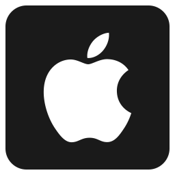

# Apple Clone Site
## Part of "AppleSeed" FullStack BootCamp
### Practicing HTML and CSS 

In this exercise I tried to be more organize and working from the outer scope inward:
  
  steps of the project:
- create the directories and files of the projects (general structure of the site)
- adding readme.md file 
- collecting the assets (images,fonts)
- collecting colors from the site and making css variables
- **starting with the homePage:** building the header(navbar)
- building the sections- (empty in the beginning and adding the content later)
- build the footer
- building the sections content
- after all the elements are in place, fine-tune the positions and size of all elements
- try to do responsive
- extra: if there will be time left- working on another page of the site

